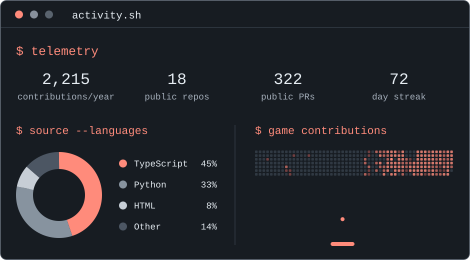

<picture>
  <source media="(max-width: 640px)" srcset="./assets/terminal-mobile.svg">
  
</picture>

  <a href="https://mon-elu.vercel.app/">MonÉlu ↗</a> ·
  <a href="https://walid-peach.github.io/interview-prep/">Interview Prep ↗</a>

  <code>$ contact</code> 
  <a href="https://walidelkhoukh.com">Portfolio ↗</a> ·
  <a href="https://www.linkedin.com/in/walid-elkhoukh">LinkedIn ↗</a> ·
  <a href="mailto:contact@walidelkhoukh.com">Email ↗</a>

Text version &amp; data notes

**Walid El Khoukh · AI & Data Engineer**

Turning complex data into useful tools.

- [MonÉlu](https://mon-elu.vercel.app/) — civic data & AI · [source](https://github.com/Walid-peach/MonElu)
- Agentarium — agent tooling. No public demo linked yet.
- [Interview Prep](https://walid-peach.github.io/interview-prep/) — learning tools · [source](https://github.com/Walid-peach/interview-prep)

**Snapshot: 2026-09-10 UTC.** 2,212 contributions in GitHub's rolling-year calendar; 18 public, owned, non-fork repositories; 322 public pull requests authored, all time; **71 day contribution streak**.

The streak counts consecutive days with GitHub contributions, including commits, pull requests and other qualifying activity; it does not count pushes specifically. A day without activity breaks the streak, except that the snapshot day has until its end to qualify. The streak is calculated from the available rolling-year calendar at each daily refresh.

Language proportions measure source bytes across public, owned, non-fork repositories, excluding Jupyter notebooks from both the donut chart and its percentages. They are not proficiency ratings. Breakout auto-plays over the calendar; cells disappear when hit and reset each loop. It is an animation, not an interactive game. Reduced-motion preferences show a static calendar.

[Portfolio](https://walidelkhoukh.com) · [LinkedIn](https://www.linkedin.com/in/walid-elkhoukh) · [Email](mailto:contact@walidelkhoukh.com)

