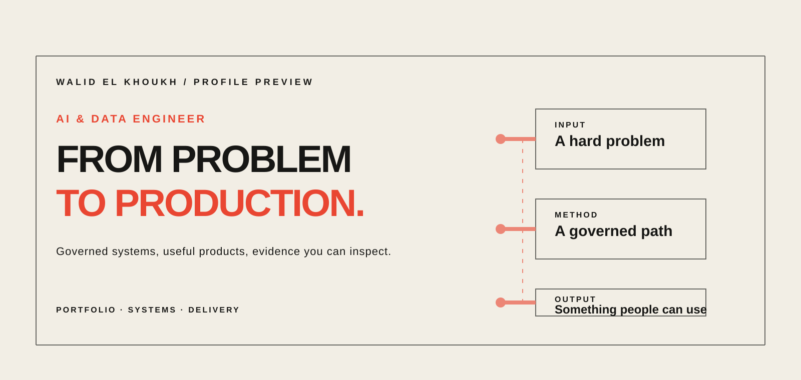
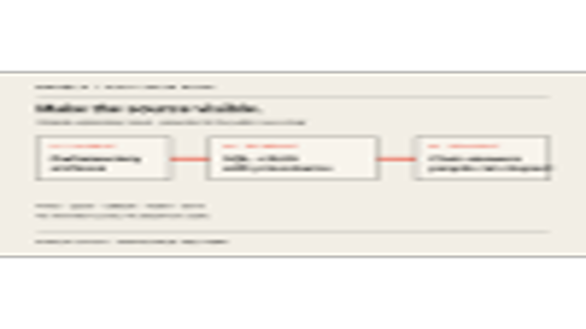
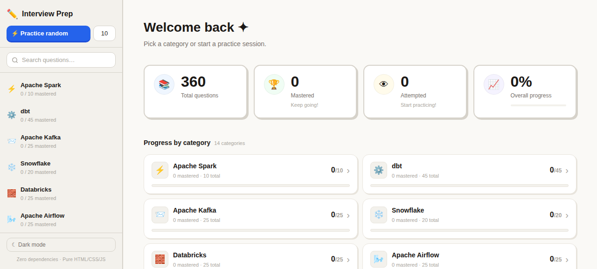

<picture>
  <source media="(prefers-color-scheme: dark)" srcset="./assets/portfolio-dark.svg">
  <source media="(prefers-color-scheme: light)" srcset="./assets/portfolio-light.svg">
  
</picture>

# Walid El Khoukh

AI & Data Engineer · From problem to production.

I build governed data systems and practical AI products with a bias toward traceability, useful interfaces, and delivery you can inspect.

[Portfolio](https://walidelkhoukh.com) · [GitHub](https://github.com/Walid-peach)

## Public signal

<!-- PUBLIC_STATS:START -->
| Public repositories | Repository stars | Latest public push | Snapshot UTC |
| ---: | ---: | --- | --- |
| 17 | 8 | 2026-09-07 | 2026-09-07 |

Public non-fork repository metadata only; stars are repository stars, not users or impact.
<!-- PUBLIC_STATS:END -->

## Selected work

### MonÉlu

A civic data product that makes parliamentary records easier to follow: static open-data archives become a governed path to SQL answers and evidence-backed retrieval.

[Open product](https://mon-elu.vercel.app/) · [Case study](https://walidelkhoukh.com/monelu/) · [Source](https://github.com/Walid-peach/MonElu)

### Agentarium

A local-first surface for truthful agent, session, delegation, and job state.

### Interview Prep

A zero-dependency flashcard-style study app for data engineering interviews, spanning Spark, Kafka, Airflow, dbt, Databricks, AWS, Kubernetes, Terraform, system design, and behavioral questions.

[Open app](https://walid-peach.github.io/interview-prep/) · [Source](https://github.com/Walid-peach/interview-prep)

## Contact

[Email](mailto:contact@walidelkhoukh.com) · [LinkedIn](https://www.linkedin.com/in/walid-elkhoukh)
